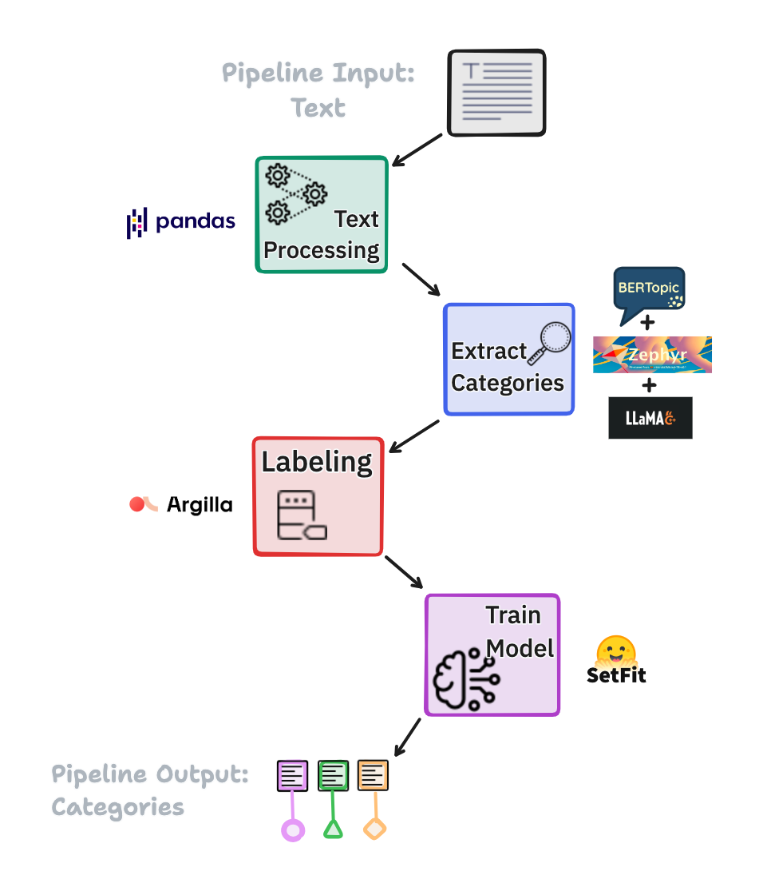
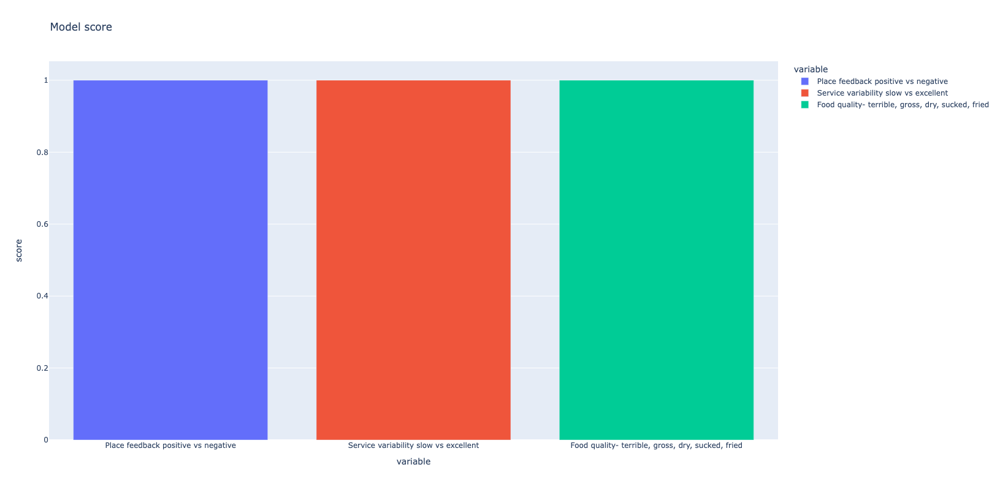

# Text Classification Pipeline



The goal of this project is to provide a robust, efficient, and highly accurate tool for understanding, organizing, and categorizing text data. With the increasing amount of text data generated every day, this pipeline offers several advantages:

1. **High Accuracy**: Text solutions often lack the reliable accuracy that decision makers can depend on when making important decisions. However, this pipeline provides exceptional accuracy, with the ability to classify text into appropriate categories with a high success rate up to 95%.

2. **Ease of Implementation**: The pipeline is open source and has been designed with ease of implementation in mind. It can be modified to suit your specific requirements and needs. This makes it particularly suitable for governmental sectors and other organizations where data privacy is paramount.

3. **Efficient Labeling**: One of the main challenges in text classification is the need for large amounts of labeled data to train a model. This pipeline significantly reduces this burden by requiring a maximum of just 15 labeled inputs for each category. This makes it easier to get started and speeds up the model training process.

Whether you are interested in topic modeling, sentiment analysis, or any other text classification task, this pipeline provides a strong foundation on which to build your solution. It is an ideal solution for data scientists, machine learning engineers, and anyone interested in natural language processing or text analytics.

## Pipeline structure:
The pipeline is composed of four significant steps:

1. **Text Preprocessing:** In this step, we perform the necessary preprocessing on the input raw text for the pipeline. It involves cleaning the text by removing empty inputs and splitting long sentences into manageable lengths.

2. **Identifying Categories:** Once the text is preprocessed, the next step is to identify categories or topics within the entire text input (what the text data is talking about). We use unsupervised clustering algorithm, [Bertopic](https://maartengr.github.io/BERTopic/index.html), to categorize the preprocessed text into similar groups, providing a high-level view of the text data's content ( Note: this is an optional step you could ignore it if you already have predefined categories)
    -  **Topic Representation Refinement**: After topics are identified and represented with Bertopic, we leverage [Zephyr](https://huggingface.co/TheBloke/zephyr-7B-alpha-GGUF), a language model for paraphrasing text, to refine these representations. Zephyr rephrases the topic representations into a more readable form, making it easier for users to understand the gist of each topic. This step enhances the user-friendliness of the pipeline, making it a more effective tool for data exploration and insight gathering.

3. **Text Labeling:** After categories are identified, each category needs to be labeled. This manual step involves assigning at least 15 inputs text to each category using open-source labeling tool called [Argilla](https://argilla.io/). This process provides the necessary labeled data for the subsequent training step.

4. **Model Training:** The final step is to train a machine learning model using the labeled categories. We use a few-shot learning model, [Setfit](https://github.com/huggingface/setfit/tree/main), which provides high accuracy even with a small amount of labeled data. The model is fine-tuned embadding model with the labeled data and then used to train a classification head, resulting in a model capable of accurately classifying new, unseen text data.


## Getting Started

To get a local copy up and running, follow these simple steps:

```bash
# Clone the repo
git clone https://github.com/EsraaMadi/Fewshot-text-classification-pipeline.git

# Access the project directory
cd Fewshot-text-classification-pipeline

# Install Python dependencies
pip install -r requirements.txt
```
For Argilla, you need to do extra [installation steps](https://docs.argilla.io/en/latest/getting_started/installation/deployments/docker_compose.html)

After installation, you need to setup the following:
1. Upload your text data as excel sheet in `data` folder
2. Add new section in the configuration file with dataset name and setup these paramters (data info: Business area, Label type, Source, Google map, Year, text_col, rg_dataset_name)

Now, you can start using the text classification pipeline. The steps of the pipeline should be executed in a specific order, each step of the pipeline is organized in its own folder in the repository. Here's how to run the code for each step:

```plaintext
/project-root
  ├── data                         # add  here your dataset (excel sheet)
  ├── images                       # images of readme file content
  ├── config.yml                   # main configuration file
  ├── identify_categories/         # Pipeline step1 + step2
  │   ├── category_selection_app/  # streamlit app to help explore extracted topics
  │   └── libs/                    # local lib files
  ├── requirements.txt             # contain a list of packages needed
  ├── mini_labeling_&_training/    # Pipeline step3 + step4 
  │   ├── label_model.py           # contains all needed fun for labeling(Argilla) and training(Setfit)
      ├── data_listener.py         # main file to run step 3, 4 
      ├── Score_tracking.ipynb     # Notebook to track the model performance between different time of training
  ├── pipeline_api/                # contain Fastapi endpoint to use trained model for inference
  ├── models/                      # contain best trained model
  └── ...
  ```

**Step 1 & 2** Text Preprocessing & Identify Categories:
```bash
# Access the step directory
cd identify_categories

# Run the jupyter notebook to extract topics
jupyter execute train_unsupervised_model.ipynb
# or open it in the editor and go through the cells one by one
```

**Step 3** Text labeling:
```bash
# Return to the root directory
cd ..

# Access the identification directory
cd mini_labeling_&_training

# Run the script to upload data to Argilla to finish labeling
python data_listener.py
```

**Step 4** Model Training:
```bash
# After finish required labeling, run the script again to train the model
python data_listener.py
```

Each step is dependent on the previous one, so they must be executed in this specific order to ensure the pipeline works correctly. After running the above steps, you have successfully set up and run the text classification pipeline.

## Application: Categorizing Restaurant Reviews 
### [My lightning talk for Pydata](https://data-persentation-app-bqbh7zfuzunhqfffdcbi25.streamlit.app/)

We applied the text classification pipeline to a dataset of restaurant reviews to demonstrate its effectiveness in a real-world scenario. The dataset comprised around 1000 of reviews, which were categorized into three aspects such as 'Service', 'Food Quality', and 'Place Feedback'.

### Results

The model was evaluated on a separate test set of unseen reviews. The accuracy achieved for each category was as follows:


These results indicate that this pipeline can effectively categorize text data with high accuracy, even with the subtle nuances present in restaurant reviews.

## What Next?
- [ ] Fix bugs in in the active learning approach for updating the few-shot model with newly labeled data.
